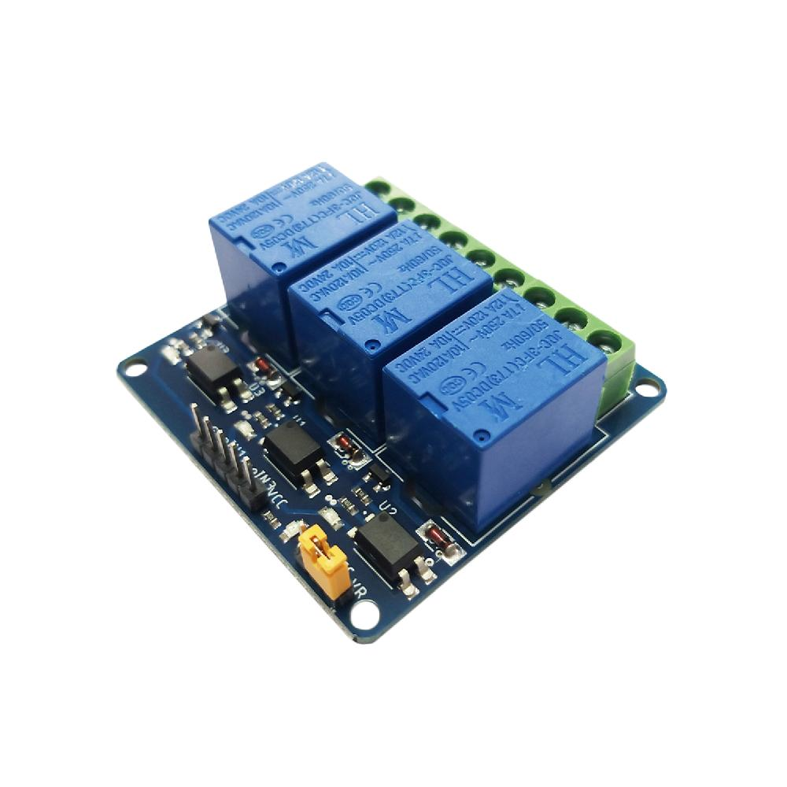

# CSE 368 - Microprocessor and Interfacing Lab

## **Lab Report On:**

### _Smart Home_

---

### **Submitted By:**

**Group 6**

- **MD MEHEDI HASAN** - Registration No: 2020331075
- **Md Ahsanul Haque Sazid** - Registration No: 2020331027
- **Avijit Debnath** - Registration No: 2020331025
- **Khaled Bin** - Registration No: 2020331055
- **Ajor Saha** - Registration No: 2020331063

---

### **Submitted To:**

**Abdullah Al Noman**  
**Lecturer, Department of Computer Science & Engineering**  
**Shahjalal University of Science and Technology (SUST)**

---

### **Introduction:**

Imagine a smart home equipped with cutting-edge features that enhance convenience, efficiency, and security. This home includes a smart parking system that autonomously guides vehicles into the garage. Inside, lighting is controlled via Wi-Fi and smartphone applications, allowing residents to adjust brightness and color to their preferences. Security is enhanced by an advanced theft and gas detection system, using sensors to monitor unauthorized access and safety. Automatic lighting activates in low-light conditions, conserving energy while ensuring optimal illumination. This report explores the integration of these smart technologies, showcasing their potential to revolutionize modern living.

---

### **Objective:**

The objective of this project is to integrate smart parking, advanced lighting control via Wi-Fi and smartphones, and a robust theft detection system into a seamless, efficient, and secure smart home environment. The aim is to optimize convenience, energy efficiency, and security.

---

### **Home (Front Side):**

---

### **Home (Back Side):**

---

### **Hardware Components:**

1.  **Arduino UNO**  
    A microcontroller board based on the ATmega328P with 14 digital input/output pins, 6 analog inputs, a 16 MHz ceramic resonator, a USB connection, a power jack, an ICSP header, and a reset button.

    

    _Function:_ Acts as the brain of the system, controlling the motors and sensors based on the programmed instructions.

2.  **Jumper Cables**  
    Necessary for connections in the circuit.

    

3.  **Sonar Sensor (HC-SR04)**  
    An ultrasonic distance sensor that uses acoustic pulses to measure distance to an object.

    

    _Function:_ Detects obstacles and sends distance data to the Arduino for navigation.

4.  **Light Sensor**  
    Measures light intensity using a photoresistor.

    

    _Function:_ Detects changes in light intensity for automatic brightness adjustment in lighting systems.

5.  **Servomotor**  
    Provides precise control over angular or linear positions, velocities, and accelerations.

    

    _Function:_ Integral to smart parking systems for maneuvering vehicles into parking spaces.

6.  **10k Ohm Resistor**  
    Used for photo detection, stabilizing the signal from the light sensor.

    

7.  **External Power Supply**  
    A mobile phone charger provides external power.

    

    _Function:_ Powers the relay module, Wi-Fi module, and other components.

8.  **LED Lights**  
    Energy-efficient light-emitting diodes.

    

    _Function:_ Provide efficient illumination with low energy consumption.

9.  **ESP8266 NodeMCU**  
    An IoT platform with Wi-Fi capability.

    

    _Function:_ Controls the entire smart home system by processing commands from the Blynk app.

10. **Relay Module**  
    A 3-relay module used to toggle electrical devices.

    

    _Functionality:_ Controls power to lights and other appliances.

11. **Gas Detector**  
    Detects hazardous gases like carbon monoxide and methane.

    

    _Functionality:_ Alerts or mitigates risks by detecting gas leaks, ensuring safety.

---

### **Software Requirement:**

1.  **Arduino IDE**  
    Used for writing and uploading code to the Arduino.
2.  **Blynk App**  
    A mobile app for controlling IoT devices.

---

### **Procedure to Build the Home:**

1.  **Design and Planning**

    - Define requirements for automated lighting, energy efficiency, and security.
    - Select components like LED lights, ESP8266 NodeMCU, relay modules, gas detector, and sensors for smart parking.
    - Create a blueprint to position sensors and devices strategically.

2.  **Programming the Arduino**

    - Install Arduino IDE.
    - Write code for light control, obstacle detection, smart parking, and relay management.
    - Upload the code to the Arduino and Wi-Fi module.

3.  **Home Construction**

    - Assemble the house using cardboard.
    - Position components like Arduino, sensors, motors, and lights according to the blueprint.
    - Connect all components securely to the Arduino using jumper cables.

---

This Markdown version is more structured, clean, and professional, making it suitable for production-level documentation.

Here is the second part of the content, cleaned and formatted as requested:

---

### B. Wiring and Connections:

#### Pin Details for Each Component:

1.  **Gas Sensor (MQ-6)**

    - **Arduino Pin:** A1 (Analog Input)
    - **Arduino Pin:** 5V (Power)
    - **Arduino Pin:** GND (Ground)

2.  **Gas Sensor Indicator LED**

    - **Arduino Pin:** 12 (Digital Output)
    - **Arduino Pin:** GND (Ground)

3.  **Ultrasonic Sensor 1 (HC-SR04) (For Parking)**

    - **TRIG Pin:** Arduino Pin 9
    - **ECHO Pin:** Arduino Pin 10
    - **VCC:** Arduino Pin 5V
    - **GND:** Arduino Pin GND

4.  **Ultrasonic Sensor 2 (HC-SR04) (For Thief Detection)**

    - **TRIG Pin:** Arduino Pin 6
    - **ECHO Pin:** Arduino Pin 7
    - **VCC:** Arduino Pin 5V
    - **GND:** Arduino Pin GND

5.  **Servo Motor**

    - **Signal Pin:** Arduino Pin 8
    - **External Power Source:** 5V
    - **GND:** Arduino Pin GND

6.  **Light Sensor (LDR)**

    - **Analog OUT Pin:** Arduino Pin A0
    - **VCC:** Arduino Pin 5V
    - **GND:** Arduino Pin GND

7.  **LED Indicators for Light Sensor**

    - **Green LED:**
      - **Arduino Pin:** 2 (Digital Output)
      - **GND:** Arduino Pin GND
    - **Yellow LED:**
      - **Arduino Pin:** 3 (Digital Output)
      - **GND:** Arduino Pin GND
    - **Red LED:**
      - **Arduino Pin:** 4 (Digital Output)
      - **GND:** Arduino Pin GND

The Arduino setup integrates several components for environmental monitoring and control. The gas sensor detects gas levels via pin A1, with an indicator LED on pin 12 signaling gas presence. Ultrasonic Sensor 1 (for parking) uses pins 9 (TRIG) and 10 (ECHO) for distance measurement, controlling a servo motor on pin 8. Ultrasonic Sensor 2 (for thief detection) is connected to pins 6 (TRIG) and 7 (ECHO). A light sensor on pin A0 reads light levels, while LEDs on pins 2, 3, and 4 provide visual feedback based on intensity. The code processes sensor data, adjusts the servo, and controls the LEDs while sending updates to the serial monitor for diagnostics.

_Figure: Connections of the components (without Wi-Fi module)_  

---

#### Relay and NodeMCU Pin Details:

- **LED Pins:**

  - LED Pin 1: D0 (Mapped to ledPin1)
  - LED Pin 2: D1 (Mapped to ledPin2)
  - LED Pin 3: D2 (Mapped to ledPin3)

- **Relay Pins:**

  - Relay Pin 1: D3 (Mapped to relayPin1)
  - Relay Pin 2: D4 (Mapped to relayPin2)
  - Relay Pin 3: D5 (Mapped to relayPin3)

**Functionality:**

- V1: Controls LED connected to D0
- V2: Controls LED connected to D1
- V3: Controls LED connected to D2
- V4: Controls Relay connected to D3
- V5: Controls Relay connected to D4
- V6: Controls Relay connected to D5

In this setup, the ESP8266 (NodeMCU) serves as the central controller, connecting to Wi-Fi and communicating with the Blynk app to manage various components. LEDs on pins D0, D1, and D2 provide visual indicators, turning on or off based on commands from the app. Relays on pins D3, D4, and D5 control high-power devices, enabling remote switching. The Blynk app uses virtual pins to control the LEDs and relays, with feedback provided through the serial monitor.

_Figure: Example connection involving ESP8266 (NodeMCU), a relay module, and bulbs_  

---

### C. Programming the Arduino:

The Arduino is programmed to read inputs from the sensors and respond accordingly.

**Code Link:**  
[Arduino Code](https://github.com/MehediHasan-75/Smart-Home-Project/blob/main/integrate.ino)

---

### D. Programming the ESP8266 NodeMCU:

The ESP8266 NodeMCU is programmed to control lights via Wi-Fi using a phone.

**Code Link:**  
[ESP8266 Code](https://github.com/MehediHasan-75/Smart-Home-Project/blob/main/Blink.ino)

#### Data Types Used:

- **const int:** Declares constants that remain unchanged.
- **int:** Used to store integer values.
- **long:** Used to store larger integers.
- **Servo:** A type used to control a servo motor via the Servo library.

---

#### Blynk Setup:

- **BLYNK_TEMPLATE_ID:** TMPL6srCHVLYh
- **BLYNK_TEMPLATE_NAME:** nodemcu
- **BLYNK_AUTH_TOKEN:** 93rVaCGyT2yKeTtMfHAY7t3OWUQzdjjb

The Blynk app connects to the NodeMCU via Wi-Fi using the above credentials. Components such as LEDs and relays are controlled remotely through the app.

---

**GitHub Link of the Project:**  
[Smart Home Project](https://github.com/MehediHasan-75/Smart-Home-Project)

---

**Conclusion:**

This project showcases home automation through the integration of various sensors and actuators. It highlights the potential of IoT, while providing a practical understanding of sensor integration and control systems.

---

This formatting simplifies the reading and understanding of the content, while keeping the necessary technical details intact. Let me know if any further changes are needed!
